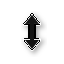
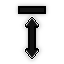
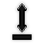
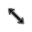
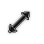
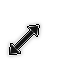
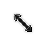

# Copyright (c) 2026 Michael De Vita. All rights reserved.
This repository is provided for transparency and personal use. While the source code is visible, it is proprietary property. Any redistribution, cloning, or commercial use without express permission is strictly prohibited and will be pursued.

# XCursor Theme Generator

A powerful, user-friendly utility designed to convert Windows cursor files (.cur, .ani) and PNG images into seamless, ready-to-use Linux XCursor themes.

## Features
- Smart Auto-Mapping: Automatically scans your files and assigns them to the correct cursor roles based on filenames.
- Format Support: Easily handle .cur, .ani, and .png input formats.
- Batch Processing: Import entire folders or compressed archives (.zip, .rar, .7z) in one click.
- One-Click Packaging: Automatically generates the index.theme and packages everything into a .tar.gz file for easy installation.

## Quick Guide
1. Import: Click "Automatically add and map files" to select a folder or archive.
2. Verify: Review the auto-mapped types and adjust using the dropdowns.
3. Generate: Fill in your theme details and hit "Generate Theme".
4. Install: tar -xf MyTheme.tar.gz -C ~/.icons/

## Cursor Reference Guide
| Preview | Details |
| :--- | :--- |
|  **left_ptr** | Default pointer/arrow |
|  **right_ptr** | Right-pointing pointer |
|  **pointer** | Hand (links/buttons) |
|  **crosshair** | Cross-shaped selector |
|  **wait** | Waiting state (static) |
|  **busy** | Busy state (animated) |
|  **help** | Question mark pointer |
|  **text** | I-beam for text selection |
|  **move** | Movement indicator |
|  **fleur** | Four-way movement arrow |
|  **size_all** | Omnidirectional resize |
|  **size_fdiag** | Diagonal resize (top-right/bottom-left) |
|  **size_bdiag** | Diagonal resize (top-left/bottom-right) |
|  **size_hor** | Horizontal resize |
|  **size_ver** | Vertical resize |
|  **top_side** | Resize top edge |
|  **bottom_side** | Resize bottom edge |
|  **left_side** | Resize left edge |
|  **right_side** | Resize right edge |
|  **top_left_corner** | Resize top-left corner |
|  **top_right_corner** | Resize top-right corner |
|  **bottom_left_corner** | Resize bottom-left corner |
|  **bottom_right_corner** | Resize bottom-right corner |
|  **forbidden** | Action not allowed |
|  **not-allowed** | Alternative forbidden icon |
